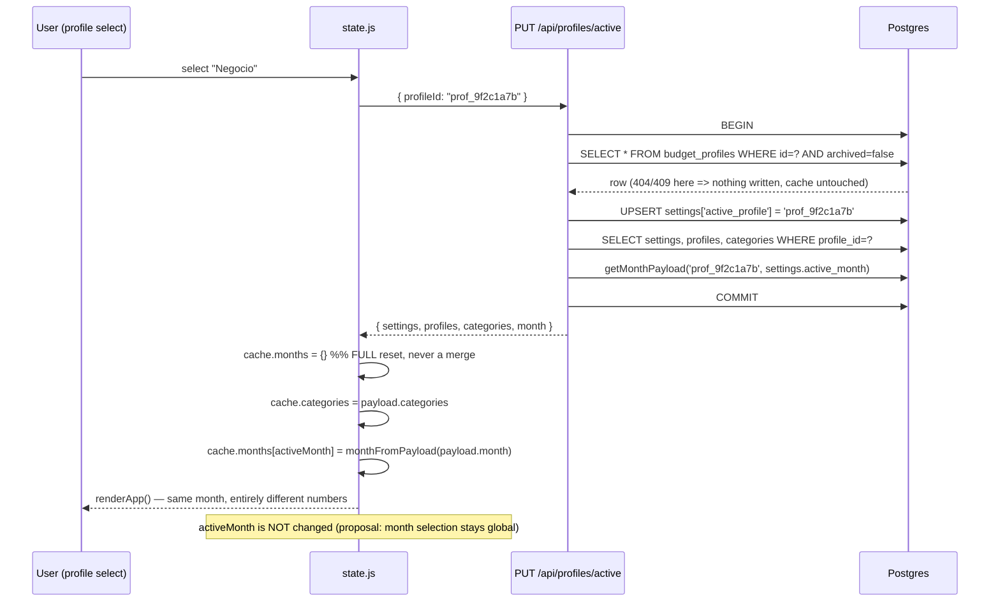

# Design: Multiple Budget Profiles

## Technical Approach

A `budget_profiles` table becomes the root of the domain graph. Every existing domain table (`categories`, `months`, `category_budgets`, `transactions`) gains a `profile_id` column, and the identity of a month becomes the composite `(profile_id, month_key)`. Isolation is enforced **structurally by composite foreign keys**, not by remembering to add a `WHERE` clause: after this change a transaction in profile A referencing a category in profile B is unrepresentable in the database.

The active profile is resolved **server-side** from `settings.active_profile` on every scoped request — exactly the precedent `server/services/months.js:17` set for `month_key` ("Clients never supply `month_key` directly"). There is no auth in this app, so a client-supplied `profile_id` would be a plain IDOR surface; server resolution removes that class of bug entirely.

The client keeps its flat `cache.months[monthKey]` map and **resets it wholesale** on a profile switch. `render.js` gains exactly one new function (`renderProfileSelect`) and nothing else; every derivation function in `src/state.js` keeps its current body verbatim.

Implements `specs/budget-profiles`, and modifies `specs/budget-persistence`, `specs/budget-api`, `specs/legacy-data-import`.

---

## Architecture Decisions

### Decision: Composite `(profile_id, month_key)` identity, not a surrogate `months.id`

**Choice**: `months` PK becomes `(profile_id, month_key)`. `category_budgets` and `transactions` each carry `profile_id` and reference months through the composite FK `(profile_id, month_key)`. `month_key` stays a `TEXT` `YYYY-MM` column on every table.

| Option | Concrete cost in *this* codebase | Decision |
|---|---|---|
| Surrogate `months.id` | `serializeTransaction(row)` (`server/routes/transactions.js:13-22`) reads `row.month_key` **directly off the transactions row**, and `src/state.js:146,170` depends on `created.monthKey` in the response to pick the cache bucket. A surrogate forces either a join to `months` on every transaction serialization, or a denormalized `month_key` kept alongside `month_id` — reintroducing the duplication the surrogate was supposed to remove, plus a new drift failure mode where `month_id` and `month_key` disagree. It also solves only the *month* side; category isolation would still need a separate mechanism. | Rejected |
| **Composite `(profile_id, month_key)`** | Every FK/PK/`onConflict` tuple grows by one column (7 call sites, enumerated below). No route signature changes shape — `/api/months/:monthKey` keeps taking the same string. | **Chosen** |

**Rationale**: `month_key` is a *pervasive* string identifier in this codebase, not an internal key — it is a URL path segment (`server/routes/months.js:26,35,59,82`), the client cache key (`src/state.js:27,36,73`), a `settings` value (`active_month`), the output of `monthKeyFromDate()`, the legacy-import payload key (`server/routes/import.js:145`), and the input to `shiftMonthKey`/`formatMonthLabel`. A surrogate id would have to be threaded through every one of those boundaries or translated at each of them. The composite keeps `month_key` exactly where it already is and only widens the tuple.

The decisive extra win is that the same composite shape extends to categories. Declaring `UNIQUE (profile_id, id)` on `categories` lets `category_budgets` and `transactions` reference `categories(profile_id, id)` instead of `categories(id)`. That makes cross-profile contamination a **constraint violation**, not a missed filter — which is the proposal's highest-likelihood risk ("A query misses its profile filter and leaks data", Likelihood: High) demoted from a code-discipline problem to a schema guarantee.

**Ordering note (`profile_id` first)**: placing `profile_id` as the leading PK column means the `months_pkey` btree directly serves `WHERE profile_id = ? AND month_key < ? ORDER BY month_key DESC LIMIT 1` — the carry-forward / `carryForward.sourceMonth` lookup (`server/services/months.js:111-114`, `server/routes/months.js:93-97`). With `month_key` first it would not.

### Decision: Active profile resolved server-side from `settings.active_profile`

**Choice**: No DDL change to `settings` — it is already `(key TEXT PRIMARY KEY, value TEXT)` (`server/migrations/001_init.js:30-33`), designed for exactly this ("key/value so new keys need no migration"). `active_profile` joins `currency`, `active_month`, `legacy_import_at`. No endpoint ever accepts a `profileId` in a body or query string except the profile router itself.

**Alternatives considered**: a path segment (`/api/profiles/:pid/months/:monthKey`); a query parameter; an `X-Profile-Id` header.

**Rationale**: All three client-supplied variants make every route responsible for validating that the id exists and is not archived, and give a buggy or stale client a way to write into the wrong profile. Server resolution has exactly one enforcement point. It also matches how `active_month` already behaves, so the mental model does not fork. The accepted cost — endpoints become stateful, so a concurrent switch could race a write — is irrelevant for a single-user, single-instance app, and is bounded anyway because the switch is one `PUT` the client awaits before re-rendering.

**Whitelist call sites that MUST be updated (both, or bootstrap silently omits the profile):**
- `server/routes/settings.js:11` — `whereIn('key', ['currency', 'active_month'])`
- `server/routes/index.js:28` — a **second, duplicated copy** of the same literal array inside `GET /bootstrap`

These two hardcoded arrays are a latent bug source. This change extracts them into a single exported `SETTINGS_KEYS` constant in a new `server/services/settings.js`, consumed by both.

`PUT /api/settings` deliberately **rejects** `activeProfile` with `400`. Switching is not a settings write: it needs FK validation and it must return the new profile's whole payload, so it gets its own endpoint (`PUT /api/profiles/active`). One write path, one place to get it right.

### Decision: Enforcement at the router mount point, not inside handlers

**Choice**: A `requireActiveProfile` middleware sets `req.profileId` and is applied at the mount in `server/routes/index.js:56-60`:

```js
router.use('/settings', settingsRouter);                                   // unscoped (reads the key)
router.use('/profiles', profilesRouter);                                   // unscoped (manages profiles)
router.use('/categories',   requireActiveProfile, categoriesRouter);
router.use('/months',       requireActiveProfile, monthsRouter);
router.use('/transactions', requireActiveProfile, transactionsRouter);
router.use('/import',       requireActiveProfile, importRouter);
```

**Alternatives considered**: resolving the profile inside each handler; a global `app.use` before `/api`.

**Rationale**: Per-handler resolution means a *future* handler added to an existing router can silently forget it — the exact failure the composite FK can catch for references but not for reads. Mount-point application makes scoping inherited by construction. A global `app.use` was rejected because `GET /api/health` is the Docker healthcheck (`docker-compose.yml`) and must not depend on `settings` rows existing.

### Decision: Deletion is archival, and at least one unarchived profile must always exist

**Choice**: `DELETE /api/profiles/{id}` sets `archived = TRUE`; it never issues a row `DELETE`. Two guards, both inside the same transaction:
1. `409 profile_is_active` — you cannot archive the profile that is currently active; switch first.
2. `409 last_profile` — you cannot archive the last unarchived profile.

**Rationale**: This reconciles two inputs that appeared to conflict. `proposal.md:23` puts row deletion out of scope ("archive only"); the design brief asks what happens when the last profile is deleted. Archival satisfies both and matches this codebase's established answer to the same question for categories — `archiveCategory` (`src/state.js:126-132`) with the comment *"No se borra físicamente: se archiva, así el histórico permanece intacto"*, backed by `ON DELETE RESTRICT` throughout `001_init.js`. A real row delete would be blocked by those same RESTRICT constraints anyway, so archival is not a compromise, it is the only shape the schema permits.

Concrete validation (race-free even though this app is single-user):

```js
await db.transaction(async (trx) => {
  const active = await trx('settings').where({ key: 'active_profile' }).first();
  if (active?.value === id) throw conflict('No puedes eliminar el presupuesto activo. Cambia a otro primero.');

  const live = await trx('budget_profiles').where({ archived: false }).forUpdate();  // row lock
  if (live.length <= 1) throw conflict('Debe existir al menos un presupuesto.');
  if (!live.some((p) => p.id === id)) throw notFound(`Profile ${id} not found`);

  await trx('budget_profiles').where({ id }).update({ archived: true });
});
```

`forUpdate()` on the unarchived set is what makes the "at least one" invariant hold under two concurrent archive requests.

### Decision: A new profile starts empty; `currency` stays global

**Choice**: `POST /api/profiles` creates zero categories and zero months. `settings.currency` remains a single global key, not per-profile.

**Rationale**: The app already renders an empty profile correctly — `render.js:67-70` shows the "Aún no tienes categorías" empty state and `render.js:134` shows "Crea una categoría primero" in the expense form. Seeding invented categories would contradict the whole point of isolation (the user asked for *separate* budgets, not *pre-filled* ones) and would put rows in the database that the user then has to delete. Currency stays global because a profile is a partition of one person's money, not a locale; making it per-profile is a later, additive change requiring no schema work (it is a `settings` key today and could become a `budget_profiles` column).

### Decision: Client cache is reset on switch, not keyed by profile

**Choice**: `setActiveProfile(id)` replaces `cache.categories` and sets `cache.months = {}` before loading the new profile's payload. The cache shape keeps one flat `months` map.

**Alternatives considered**: `cache.profiles[profileId].months[monthKey]`.

**Rationale**: `render.js:101` reads `data.months[monthKey]` and `src/state.js:196-223` (`getCategorySpent`, `getCategoryBudget`, `getCategoryRemaining`, `getMonthTotals`) all read through `readMonth(monthKey)`. Keying the cache by profile would change the signature of every one of those functions and force `render.js` to become profile-aware — breaking the "`render.js` is a pure synchronous reader over `defaultData()`'s shape" contract that the previous change was explicitly designed to protect (`archive/2026-08-29-server-persistence/design.md`, "Frontend Migration Path"). A full reset also makes a stale cross-profile row **unrepresentable in the cache**, mirroring the database guarantee. The cost — re-fetching a month you already viewed after switching back — is one request on a local network.

---

## Data Flow

```
                     settings.active_profile  (single source of truth)
                                │
main.js ──▶ state.js ──fetch──▶ requireActiveProfile ──▶ req.profileId
   │                                      │
   │                                      ▼
   │                      routes/{categories,months,transactions,import}
   │                                      │  every query carries profile_id
   │                                      ▼
   │                       Postgres — composite FKs make a
   │                       cross-profile reference impossible
   │  ◀──── JSON (no profileId field in any payload) ────┘
   ▼
render.js (pure sync read of cache)
```

**No payload leaks the profile id.** Category, month, and transaction responses keep byte-identical shapes. The client never sees a `profileId` on a domain object, so it cannot key off one, and every existing contract test in `tests/contract/` stays meaningful.

---

## Target Schema (resulting DDL)

```sql
CREATE TABLE budget_profiles (
  id         TEXT PRIMARY KEY,
  name       TEXT NOT NULL CHECK (length(btrim(name)) > 0),
  archived   BOOLEAN NOT NULL DEFAULT FALSE,
  created_at TIMESTAMPTZ NOT NULL DEFAULT now()
);

-- Case-insensitive name uniqueness among LIVE profiles only, so an archived
-- "Negocio" does not block creating a new one.
CREATE UNIQUE INDEX budget_profiles_live_name_unique
  ON budget_profiles (lower(btrim(name))) WHERE archived = FALSE;

-- categories: id stays the global PK (client-generated cat_xxxxxxxx), and a
-- (profile_id, id) UNIQUE is added purely as a composite FK target.
ALTER TABLE categories
  ADD COLUMN profile_id TEXT NOT NULL REFERENCES budget_profiles(id) ON DELETE RESTRICT,
  ADD CONSTRAINT categories_profile_id_unique UNIQUE (profile_id, id);
CREATE INDEX categories_profile_idx ON categories (profile_id, created_at);

-- months: identity is now the pair.
ALTER TABLE months
  ADD COLUMN profile_id TEXT NOT NULL REFERENCES budget_profiles(id) ON DELETE RESTRICT;
ALTER TABLE months DROP CONSTRAINT months_pkey;
ALTER TABLE months ADD PRIMARY KEY (profile_id, month_key);   -- profile_id FIRST

-- category_budgets: 3-column PK, both FKs composite.
ALTER TABLE category_budgets ADD COLUMN profile_id TEXT NOT NULL;
ALTER TABLE category_budgets DROP CONSTRAINT category_budgets_pkey;
ALTER TABLE category_budgets ADD PRIMARY KEY (profile_id, month_key, category_id);
ALTER TABLE category_budgets
  ADD FOREIGN KEY (profile_id, month_key)   REFERENCES months(profile_id, month_key) ON DELETE RESTRICT,
  ADD FOREIGN KEY (profile_id, category_id) REFERENCES categories(profile_id, id)    ON DELETE RESTRICT;

-- transactions: id stays the global PK, both FKs composite.
ALTER TABLE transactions ADD COLUMN profile_id TEXT NOT NULL;
ALTER TABLE transactions
  ADD FOREIGN KEY (profile_id, month_key)   REFERENCES months(profile_id, month_key) ON DELETE RESTRICT,
  ADD FOREIGN KEY (profile_id, category_id) REFERENCES categories(profile_id, id)    ON DELETE RESTRICT;

DROP INDEX transactions_month_idx;
DROP INDEX transactions_month_cat_idx;
CREATE INDEX transactions_profile_month_idx     ON transactions (profile_id, month_key);
CREATE INDEX transactions_profile_month_cat_idx ON transactions (profile_id, month_key, category_id);
```

**Derived-balance invariant is untouched**: `budget_profiles` stores no amount of any kind. `tests/contract/invariant.test.js` (which queries `information_schema.columns` for `spent`/`remaining`/`available`) passes unchanged.

### FK graph, before and after

```
BEFORE                                  AFTER
                                        budget_profiles
                                          ▲    ▲
categories ◀── category_budgets           │    │
    ▲              │                  categories ◀── category_budgets
    │              ▼                      ▲  (profile_id, id)    │  (profile_id, month_key)
    │           months                    │                      ▼
    │              ▲                      └────────────────── months
transactions ──────┘                  transactions ──(profile_id, month_key)──┘
                                                   └──(profile_id, category_id)──▶ categories
```

The single-column FKs `category_budgets.month_key → months.month_key`, `transactions.month_key → months.month_key`, `category_budgets.category_id → categories.id`, and `transactions.category_id → categories.id` are **dropped** — the first two *must* be (once `months.month_key` alone is no longer unique they are invalid, and Postgres will refuse to drop `months_pkey` while they exist), the last two are subsumed by the composite and dropping them removes a redundant per-write constraint check.

---

## Migration `server/migrations/002_budget_profiles.js`

Knex wraps each migration in a transaction by default and Postgres has transactional DDL, so the entire sequence below is atomic: any failure — including the row-count assertions — rolls back to the `001` shape with zero partial state. The migration MUST NOT set `disableTransactions` and MUST NOT open its own nested transaction.

```js
const DEFAULT_PROFILE_ID = 'prof_default';   // deliberately literal, not generateId():
const DEFAULT_PROFILE_NAME = 'General';      // down() and tests must be able to name it.

export async function up(knex) {
  // 1 — profiles table + live-name uniqueness
  await knex.schema.createTable('budget_profiles', (t) => {
    t.text('id').primary();
    t.text('name').notNullable();
    t.check('length(btrim(name)) > 0', [], 'budget_profiles_name_not_blank');
    t.boolean('archived').notNullable().defaultTo(false);
    t.timestamp('created_at', { useTz: true }).notNullable().defaultTo(knex.fn.now());
  });
  await knex.raw(
    `CREATE UNIQUE INDEX budget_profiles_live_name_unique
       ON budget_profiles (lower(btrim(name))) WHERE archived = FALSE`
  );

  // 2 — the default profile every existing row will belong to
  await knex('budget_profiles').insert({ id: DEFAULT_PROFILE_ID, name: DEFAULT_PROFILE_NAME });

  // 3 — count BEFORE (zero-data-loss assertion baseline)
  const before = await counts(knex);

  // 4 — add NULLABLE profile_id everywhere (NOT NULL here would fail on non-empty tables)
  for (const table of ['categories', 'months', 'category_budgets', 'transactions']) {
    await knex.schema.alterTable(table, (t) => t.text('profile_id').nullable());
  }

  // 5 — backfill every existing row into the default profile
  for (const table of ['categories', 'months', 'category_budgets', 'transactions']) {
    await knex(table).update({ profile_id: DEFAULT_PROFILE_ID });
  }

  // 6 — assert zero loss and zero orphans BEFORE constraining
  const after = await counts(knex);
  for (const table of Object.keys(before)) {
    if (before[table] !== after[table]) {
      throw new Error(`002: row count changed for ${table}: ${before[table]} -> ${after[table]}`);
    }
    const [{ count: nulls }] = await knex(table).whereNull('profile_id').count();
    if (Number(nulls) !== 0) throw new Error(`002: ${nulls} rows in ${table} left unbackfilled`);
  }

  // 7 — NOT NULL now that every row has a value
  for (const table of ['categories', 'months', 'category_budgets', 'transactions']) {
    await knex.schema.alterTable(table, (t) => t.text('profile_id').notNullable().alter());
  }

  // 8 — DROP dependent single-column FKs FIRST. months_pkey cannot be dropped
  //     while any FK still references months(month_key) alone.
  await knex.schema.alterTable('category_budgets', (t) => {
    t.dropForeign(['month_key']);     // category_budgets_month_key_foreign
    t.dropForeign(['category_id']);   // category_budgets_category_id_foreign
    t.dropPrimary();                  // category_budgets_pkey
  });
  await knex.schema.alterTable('transactions', (t) => {
    t.dropForeign(['month_key']);
    t.dropForeign(['category_id']);
    t.dropIndex('month_key', 'transactions_month_idx');
    t.dropIndex(['month_key', 'category_id'], 'transactions_month_cat_idx');
  });

  // 9 — reshape identities
  await knex.schema.alterTable('months', (t) => {
    t.dropPrimary();                                  // months_pkey
    t.primary(['profile_id', 'month_key']);           // profile_id FIRST (index ordering)
    t.foreign('profile_id').references('id').inTable('budget_profiles').onDelete('RESTRICT');
  });
  await knex.schema.alterTable('categories', (t) => {
    t.unique(['profile_id', 'id'], { indexName: 'categories_profile_id_unique' });
    t.foreign('profile_id').references('id').inTable('budget_profiles').onDelete('RESTRICT');
    t.index(['profile_id', 'created_at'], 'categories_profile_idx');
  });

  // 10 — composite FKs: cross-profile references become unrepresentable
  await knex.schema.alterTable('category_budgets', (t) => {
    t.primary(['profile_id', 'month_key', 'category_id']);
    t.foreign(['profile_id', 'month_key']).references(['profile_id', 'month_key']).inTable('months').onDelete('RESTRICT');
    t.foreign(['profile_id', 'category_id']).references(['profile_id', 'id']).inTable('categories').onDelete('RESTRICT');
  });
  await knex.schema.alterTable('transactions', (t) => {
    t.foreign(['profile_id', 'month_key']).references(['profile_id', 'month_key']).inTable('months').onDelete('RESTRICT');
    t.foreign(['profile_id', 'category_id']).references(['profile_id', 'id']).inTable('categories').onDelete('RESTRICT');
    t.index(['profile_id', 'month_key'], 'transactions_profile_month_idx');
    t.index(['profile_id', 'month_key', 'category_id'], 'transactions_profile_month_cat_idx');
  });

  // 11 — the app has an active profile the instant it boots
  await knex('settings')
    .insert({ key: 'active_profile', value: DEFAULT_PROFILE_ID })
    .onConflict('key').merge();
}
```

A **fresh install** (empty tables) takes exactly the same path: the default profile is created, the backfill updates zero rows, the assertions trivially pass. Fresh and migrated databases converge on one schema — there is no second code path to test.

### `down()` — refuses rather than silently merging

```js
export async function down(knex) {
  // A rollback after a SECOND profile has been used would collapse two
  // isolated budgets into one — exactly the data loss this change forbids.
  // Refuse loudly; the pg_dump is the recovery path in that case.
  for (const table of ['categories', 'months', 'category_budgets', 'transactions']) {
    const [{ count }] = await knex(table).whereNot('profile_id', DEFAULT_PROFILE_ID).count();
    if (Number(count) > 0) {
      throw new Error(
        `002 down(): ${count} rows in ${table} belong to a non-default profile. ` +
        `Rolling back would merge isolated budgets. Restore the pre-migration pg_dump instead.`
      );
    }
  }
  // reverse of up(): composite FKs/PKs -> single-column, drop columns, drop table
  // ... restores exactly the 001 shape, then:
  await knex('settings').where({ key: 'active_profile' }).delete();
  await knex.schema.dropTable('budget_profiles');
}
```

`down()` is therefore **safe and lossless exactly when nothing new was created**, which is the only rollback window that matters (a bad deploy discovered before the owner starts using a second profile). Past that window, rollback is a dump restore, and the proposal's `pg_dump`-first step is what makes that survivable.

---

## Query Rewrites

### `getMonthPayload()` — `server/services/months.js:51-134`

Signature becomes `getMonthPayload(profileId, monthKey, executor = db)`. Five queries change:

```js
// 1 — month row
const monthRow = await executor('months').where({ profile_id: profileId, month_key: monthKey }).first();

// 2 — budgets
const budgetRows = await executor('category_budgets').where({ profile_id: profileId, month_key: monthKey });

// 3 — transactions (ordering unchanged: date DESC, id DESC)
const transactionRows = await executor('transactions')
  .where({ profile_id: profileId, month_key: monthKey })
  .orderBy([{ column: 'date', order: 'desc' }, { column: 'id', order: 'desc' }]);
```

The raw per-category aggregate (`months.js:77-87`) becomes:

```sql
SELECT c.id,
       COALESCE(b.amount, 0)                               AS budget,
       COALESCE(SUM(t.amount), 0)                          AS spent,
       COALESCE(b.amount, 0) - COALESCE(SUM(t.amount), 0)  AS remaining
FROM categories c
LEFT JOIN category_budgets b
       ON b.category_id = c.id
      AND b.profile_id  = c.profile_id     -- defense in depth
      AND b.month_key   = ?
LEFT JOIN transactions t
       ON t.category_id = c.id
      AND t.profile_id  = c.profile_id     -- defense in depth
      AND t.month_key   = ?
WHERE c.profile_id = ?
GROUP BY c.id, b.amount
```

Bindings: `[monthKey, monthKey, profileId]`.

The `WHERE c.profile_id = ?` is what scopes the result set. The two `b.profile_id = c.profile_id` / `t.profile_id = c.profile_id` join predicates are *logically* redundant given the composite FKs — but they are free (they hit the same index) and they mean the aggregate remains leak-proof even if a future migration relaxes a constraint. This mirrors the `GROUP BY c.id, b.amount` shape already in place; nothing else about the aggregate changes.

### `carryForward.sourceMonth` hint — `server/services/months.js:111-114`

```js
const previousMonth = await executor('months')
  .where({ profile_id: profileId })
  .andWhere('month_key', '<', monthKey)
  .orderBy('month_key', 'desc')
  .first();
```

### Carry-forward endpoint — `server/routes/months.js:81-126`

Four statements change inside the existing transaction:

```js
// :88 — "already materialized?" check
const existing = await trx('months').where({ profile_id, month_key: monthKey }).first();

// :93-97 — the source month MUST come from this profile only
const previous = await trx('months')
  .where({ profile_id })
  .andWhere('month_key', '<', monthKey)
  .orderBy('month_key', 'desc')
  .first();

// :108 — source budgets
const previousBudgets = await trx('category_budgets')
  .where({ profile_id, month_key: previous.month_key });

// :110-114 — copied rows carry the same profile
await trx('category_budgets').insert({
  profile_id, month_key: monthKey, category_id: budget.category_id, amount: budget.amount,
});
```

**Both** the hint (`services/months.js:111`) and the endpoint (`routes/months.js:93`) must be scoped. Scoping only one produces a subtle, user-visible bug: the UI would offer "carry forward from 2026-07" based on another profile's month, and the endpoint would then copy from a *different* month than the hint promised — or from none at all. They must be changed together and asserted together.

### `materializeMonth()` — `server/services/months.js:38-41`

```js
export async function materializeMonth(trx, profileId, monthKey) {
  await trx('months')
    .insert({ profile_id: profileId, month_key: monthKey })
    .onConflict(['profile_id', 'month_key']).ignore();
  return trx('months').where({ profile_id: profileId, month_key: monthKey }).first();
}
```

Callers to update: `server/routes/months.js:43,70,98`, `server/routes/categories.js:26`, `server/routes/transactions.js:55,106`, `server/routes/import.js` (via the months loop).

### `onConflict` tuples that grow to three columns

Every one of these currently uses `['month_key', 'category_id']` and becomes `['profile_id', 'month_key', 'category_id']`. Missing one is a runtime `duplicate key` error, not a leak — loud, but it will only surface on a second write to the same cell:

- `server/routes/categories.js:29` (`applyBudget`)
- `server/routes/months.js:73` (`PUT /budgets/:categoryId`)
- `server/routes/import.js:174` (legacy budget import)

---

## API Contract Changes

All responses JSON. Errors keep the existing `{ "error": { "code", "message", "field?" } }` shape.

### New: `server/routes/profiles.js`

| Method | Path | Request | Response |
|---|---|---|---|
| GET | `/api/profiles` | `?includeArchived=1` optional | `[{ id, name, archived, createdAt }]`, live first, `created_at ASC` |
| POST | `/api/profiles` | `{ id?, name }` | `201` profile; `400` blank name; `409` duplicate live name. Creates **no** categories or months |
| PATCH | `/api/profiles/{id}` | `{ name }` | profile; `404` unknown; `409` duplicate live name |
| DELETE | `/api/profiles/{id}` | — | `204`; `409 profile_is_active`; `409 last_profile`; `404` unknown |
| PUT | `/api/profiles/active` | `{ profileId }` | full bootstrap payload for the new profile (below); `404` unknown; `409` archived |

`PUT /api/profiles/active` returns the same shape as `GET /api/bootstrap` deliberately: the switch is one round trip, and the client cannot render a half-swapped state where the new profile's categories are paired with the old profile's transactions.

### Changed shapes

| Endpoint | Change |
|---|---|
| `GET /api/settings` | `+ activeProfile: "prof_default"` |
| `PUT /api/settings` | `activeProfile` in the body → `400 use PUT /api/profiles/active` |
| `GET /api/bootstrap` | `+ profiles: [...]`, `+ settings.activeProfile` |
| `GET /api/categories` | Implicitly scoped. Response shape **unchanged** |
| `POST /api/categories` | Writes `profile_id = req.profileId`. Shape unchanged |
| `PATCH /api/categories/{id}` | Lookup gains `.where({ profile_id })`; a foreign id returns **`404`, not `403`** — a profile must not be able to probe another profile's ids |
| `GET/PUT/POST /api/months/*` | Implicitly scoped. Shapes unchanged |
| `POST /api/transactions` | Writes `profile_id`; rejects a `categoryId` outside the profile with the existing `400 Unknown category` |
| `PUT/DELETE /api/transactions/{id}` | Lookup gains `.where({ profile_id })`; foreign id → `404` |
| `POST /api/import/legacy` | Targets `prof_default` explicitly, **not** `req.profileId` (see Risks) |

### Cross-profile write paths that composite FKs do **not** close

`categories.id` and `transactions.id` stay globally unique client-generated strings. Three handlers therefore look a row up by id alone today and would silently operate across profiles:

- `server/routes/categories.js:76` — `db('categories').where({ id }).first()`
- `server/routes/transactions.js:81` — `db('transactions').where({ id }).first()`
- `server/routes/transactions.js:121` — `db('transactions').where({ id }).delete()`

The composite FK guarantees a row never *references* across profiles; it does not stop a handler from *editing* a row it should not see. All three need `profile_id: req.profileId` in the predicate. This is the single highest-value review checklist item in the change.

---

## Sequence: Switching Profile



The write and the read happen in one transaction, so the returned payload can never describe a profile other than the one just activated. If the `PUT` fails, `state.js` throws before touching the cache and `withBusy()` (`src/main.js:66-84`) renders the error banner — the old profile stays on screen and stays correct.

---

## Sequence: Production Migration

```mermaid
sequenceDiagram
    participant Op as Owner
    participant PG as Postgres (production volume)
    participant EP as docker-entrypoint.sh
    participant APP as Express

    Op->>PG: pg_dump -Fc > pre-002.dump      %% MANDATORY, verified restorable
    Op->>PG: SELECT count(*) per table       %% recorded baseline
    Op->>EP: docker compose up -d --build
    EP->>PG: knex migrate:latest  (002 inside ONE transaction)
    PG->>PG: create budget_profiles + insert 'General'
    PG->>PG: add nullable profile_id x4, backfill x4
    PG->>PG: assert counts unchanged && zero NULLs  -- else ROLLBACK
    PG->>PG: NOT NULL, drop old FK/PK, add composite FK/PK
    PG->>PG: settings['active_profile'] = 'prof_default'
    PG-->>EP: COMMIT
    EP->>APP: exec node server/index.js
    Op->>APP: verify counts + month totals match the recorded baseline
    Note over EP,APP: a failed migration exits non-zero; Express never binds
```

A failed migration leaves the `001` schema exactly as it was — Postgres rolls back DDL with everything else — and the entrypoint's `set -e` stops the app from serving against a half-migrated database.

---

## Client Changes

### `index.html`

Header gains a profile nav above the existing month nav (`index.html:15-19`):

```html
<div class="profile-nav">
  <select id="profileSelect" aria-label="Presupuesto activo"></select>
  <button id="manageProfilesBtn" class="btn-icon-sm" aria-label="Gestionar presupuestos">⚙</button>
</div>
```

Plus one new overlay `#profileFormOverlay` / `#profileForm`, structured exactly like `#categoryFormOverlay` (`index.html:66-98`): hidden `#profileId`, `#profileName`, a `#deleteProfileBtn` shown only when editing, and `data-close` cancel — so the existing `closeAllOverlays()` / `[data-close]` wiring (`main.js:23-36`) picks it up with no changes.

### `src/api.js`

Five thin additions following the existing pattern:

```js
export function getProfiles()             { return request('/profiles'); }
export function createProfile(payload)    { return request('/profiles', { method: 'POST', body: payload }); }
export function renameProfile(id, name)   { return request(`/profiles/${encodeURIComponent(id)}`, { method: 'PATCH', body: { name } }); }
export function archiveProfile(id)        { return request(`/profiles/${encodeURIComponent(id)}`, { method: 'DELETE' }); }
export function setActiveProfile(id)      { return request('/profiles/active', { method: 'PUT', body: { profileId: id } }); }
```

### `src/storage.js`

`defaultData()` gains two fields so the cache factory still describes the whole cache:

```js
settings: { currency: 'USD', activeMonth: null, activeProfile: null },
profiles: [],
```

### `src/state.js`

New exports, plus `bootstrap()` filling `cache.profiles` / `cache.settings.activeProfile`:

```js
export function getProfiles()      { return cache.profiles.filter(p => !p.archived); }
export function getActiveProfile() { return cache.profiles.find(p => p.id === cache.settings.activeProfile) || null; }

// The ONLY place the cache is reset. Full replacement, never a merge — a stale
// row from another profile must be unrepresentable in the cache, mirroring the
// composite-FK guarantee in the database.
export async function setActiveProfile(profileId) {
  const payload = await api.setActiveProfile(profileId);
  cache.settings  = { ...payload.settings };
  cache.profiles  = payload.profiles.map(p => ({ ...p }));
  cache.categories = payload.categories.map(c => ({ ...c }));
  cache.months = {};                                   // <-- the reset
  if (payload.month) cache.months[payload.month.monthKey] = monthFromPayload(payload.month);
}

export async function addProfile(name)          { /* api.createProfile -> push into cache.profiles */ }
export async function renameProfile(id, name)   { /* api.renameProfile -> replace in place */ }
export async function archiveProfile(id)        { /* api.archiveProfile -> mark archived */ }
```

**Every derivation function keeps its body verbatim.** `readMonth`, `getCategorySpent`, `getCategoryBudget`, `getCategoryRemaining`, and `getMonthTotals` (`src/state.js:26-28, 196-223`) are untouched — which is why `tests/unit/state.test.js`, which builds a literal cache object, should pass without modification. That is a deliberate verification signal: if those unit tests need editing, profile awareness leaked into the pure layer and the design was violated.

### `src/render.js` — one added function (correction to the proposal)

`proposal.md:51` states `src/render.js` stays **Unchanged**. That is not achievable: `#profileSelect` is a state-driven `<select>`, and `render.js` is the only module permitted to write the DOM from state. Populating it from `main.js` would put presentation logic in the event layer and break the container/presentation split the codebase already maintains. The design therefore adds exactly one function, called from `renderApp()`:

```js
function renderProfileSelect() {
  const select = document.getElementById('profileSelect');
  const profiles = getProfiles();
  const activeId = getData().settings.activeProfile;
  select.innerHTML = profiles
    .map(p => `<option value="${p.id}" ${p.id === activeId ? 'selected' : ''}>${p.name}</option>`)
    .join('');
}
```

`render.js` remains a pure synchronous reader — it gains a read target, not a behavior.

### `src/main.js`

```js
document.getElementById('profileSelect').addEventListener('change', withBusy(
  () => document.getElementById('profileSelect'),
  async (e) => { await setActiveProfile(e.target.value); }
));
```

Plus `#manageProfilesBtn` opening `profileFormOverlay`, a `#profileForm` submit handler branching create/rename on the hidden `#profileId`, and `#deleteProfileBtn` calling `archiveProfile` behind a `confirm()` — the same shape as the existing category delete handler (`main.js:195-207`).

---

## File Changes

| File | Action | Description |
|---|---|---|
| `server/migrations/002_budget_profiles.js` | Create | Profiles table, backfill, composite keys, assertions, refusing `down()` |
| `server/services/profiles.js` | Create | `resolveActiveProfileId()`, `requireActiveProfile` middleware, archive invariants |
| `server/services/settings.js` | Create | Single `SETTINGS_KEYS` constant, ending the duplicated whitelist |
| `server/routes/profiles.js` | Create | List / create / rename / archive / activate |
| `server/services/months.js` | Modify | `getMonthPayload(profileId, …)`, `materializeMonth(trx, profileId, …)`, scoped aggregate + previous-month lookup |
| `server/routes/months.js` | Modify | All four handlers scoped; carry-forward source stays in-profile |
| `server/routes/categories.js` | Modify | Scoped read/insert; `PATCH` gains a `profile_id` predicate (404 on foreign id) |
| `server/routes/transactions.js` | Modify | Scoped insert; `PUT`/`DELETE` gain a `profile_id` predicate (404 on foreign id) |
| `server/routes/settings.js` | Modify | Expose `activeProfile`; reject writing it; use `SETTINGS_KEYS` |
| `server/routes/index.js` | Modify | Mount `requireActiveProfile`; `/bootstrap` returns `profiles`; use `SETTINGS_KEYS` |
| `server/routes/import.js` | Modify | Pin every insert to `prof_default` |
| `index.html` | Modify | Profile nav + `#profileFormOverlay` |
| `src/api.js` | Modify | Five profile methods |
| `src/storage.js` | Modify | `defaultData()` gains `settings.activeProfile` and `profiles` |
| `src/state.js` | Modify | Profile readers/mutators; `setActiveProfile` full cache reset. Derivations untouched |
| `src/render.js` | Modify | `renderProfileSelect()` only |
| `src/main.js` | Modify | Switcher + manage-profiles handlers |
| `tests/contract/profiles.test.js` | Create | CRUD, activation, last-profile and active-profile invariants |
| `tests/contract/isolation.test.js` | Create | Per-endpoint leakage matrix |
| `tests/contract/migration.test.js` | Create | Backfill fidelity + `down()` refusal |
| `tests/contract/{categories,months,transactions,settings,import,health-bootstrap}.test.js` | Modify | Seed the default profile; assert unchanged shapes |
| `tests/unit/state.test.js` | Unchanged | Deliberate signal — pure derivations must not become profile-aware |

---

## Testing Strategy

| Layer | What to test | Approach |
|---|---|---|
| Unit | `readMonth`/`getCategorySpent`/`getCategoryBudget`/`getCategoryRemaining`/`getMonthTotals` still pass the **existing, unedited** `tests/unit/state.test.js` | Vitest, literal cache object |
| Unit | `setActiveProfile()` empties `cache.months` and replaces `cache.categories` — asserted on a cache pre-loaded with another profile's rows | Vitest with a stubbed `api` module |
| Contract | Full profile CRUD: create, duplicate live name → `409`, rename, archive, list ordering | supertest + ephemeral Postgres (`tests/contract/support.js`) |
| Contract (invariant) | Archiving the last live profile → `409`; archiving the active profile → `409`; both leave `budget_profiles` unchanged | supertest + direct SQL count |
| Contract (isolation) | For each of `GET /categories`, `GET /months/{k}`, `POST /transactions`, carry-forward: seed two profiles with distinct data, switch, assert **zero** rows from the other profile in every response and in `totals`/`categoryTotals` | supertest, two-profile fixture |
| Contract (isolation) | `PATCH /categories/{foreignId}`, `PUT /transactions/{foreignId}`, `DELETE /transactions/{foreignId}` all return `404` and mutate nothing | supertest + SQL readback of the foreign row |
| Contract (schema) | `INSERT INTO transactions` with a `category_id` from another profile is rejected by the database itself (composite FK), not just by the route | Direct Knex insert, expect a Postgres FK error |
| Contract (carry-forward) | With months in both profiles, carry-forward copies only in-profile budgets, and `carryForward.sourceMonth` from `GET /months/{k}` equals the `copiedFrom` the endpoint actually used | supertest, both values asserted equal |
| Contract (migration) | Seed the `001` schema with N categories / M months / P budgets / Q transactions, run `002`, assert counts identical and every row `profile_id = 'prof_default'`, and that `active_profile` is set | Knex `migrate.up` against ephemeral Postgres |
| Contract (migration) | `002.down()` succeeds on a default-only database and restores the `001` shape; `002.down()` **throws** once a second profile owns rows | Knex `migrate.down`, expect rejection |
| Contract (invariant) | `information_schema.columns` still contains no `spent`/`remaining`/`available` after `002` | existing `tests/contract/invariant.test.js`, unchanged |
| Parity | Server `categoryTotals` for profile B equals the client pure functions over profile B's cache — the existing parity test re-run per profile | `tests/contract/parity.test.js`, extended fixture |
| Manual | On a copy of the production dump: run `002`, compare per-table counts and per-month totals to the pre-migration values | Documented checklist in the change |

`strict_tdd: true` and `apply.tdd: true` (`openspec/config.yaml`) apply: the isolation and invariant tests above are RED-first.

---

## Threat Matrix

N/A — this change introduces no agent routing, shell-command construction from user input, subprocess orchestration, VCS/PR automation, or executable-file classification boundary.

| Boundary | Applicability |
|---|---|
| Documentation-like paths | N/A — no file-classification or execution-by-extension logic |
| Git repository selection | N/A — no VCS invocation |
| Commit state | N/A — no VCS invocation |
| Push state | N/A — no VCS invocation |
| PR commands | N/A — no PR automation |

The only subprocess remains `knex migrate:latest` in `docker-entrypoint.sh`, with a fixed argument list and no user-controlled input — unchanged from the `server-persistence` design.

---

## Migration / Rollout

1. `pg_dump -Fc` the production database and **verify the dump restores** into a scratch database. This is the only true rollback for the post-adoption window.
2. Record per-table counts and the current month's totals from the running app.
3. Rehearse: restore the dump into the scratch database, run `002`, re-check counts and totals. Do not skip this — it is the only place the real data shape gets tested.
4. Tag the current build as the rollback target.
5. Deploy. `docker-entrypoint.sh` runs `knex migrate:latest`; a failed `002` rolls back wholly and Express never binds.
6. Verify: counts match step 2, totals match step 2, everything sits under "General", the switcher shows exactly one profile.
7. Only then create "Negocio" in the UI. Creating a second profile is the point after which `down()` will refuse and the dump becomes the rollback path.
8. On failure before step 7: `knex migrate:down` + redeploy the tagged build. On failure after step 7: restore the dump.

---

## New Risks Discovered During Design

| Risk | Severity | Detail / Mitigation |
|---|---|---|
| Id-based handlers edit across profiles | **High** | `categories.js:76`, `transactions.js:81`, `transactions.js:121` look up by globally unique id. Composite FKs prevent bad *references*, not unauthorized *edits*. All three need a `profile_id` predicate returning `404`. Covered by a dedicated contract test. |
| Legacy import lands in the wrong profile | **High** | `server/routes/import.js` would write into whichever profile happens to be active. A user who creates "Negocio", switches, then clicks the import banner scatters years of history into the wrong budget. **Mitigation**: import targets `prof_default` unconditionally, never `req.profileId`. |
| Duplicated settings whitelist | Med | `settings.js:11` and `index.js:28` hardcode the same key array. Updating one and not the other makes `GET /bootstrap` silently omit `activeProfile`, so the client boots with `activeProfile: null` and the switcher renders empty. **Mitigation**: extract `SETTINGS_KEYS`. |
| Carry-forward hint / endpoint drift | Med | The source-month lookup exists twice (`services/months.js:111`, `routes/months.js:93`). Scoping one but not the other makes the UI promise a carry-forward from a month the endpoint will not use. **Mitigation**: a contract test asserting `carryForward.sourceMonth === copiedFrom`. |
| `proposal.md` claims `render.js` unchanged | Low | Not achievable for a state-driven `<select>`. Resolved by adding one read-only `renderProfileSelect()`; the proposal's "Affected Areas" row is superseded by this design. |
| `onConflict` tuple widening | Low | Three sites grow to three columns (`categories.js:29`, `months.js:73`, `import.js:174`). Failure mode is a loud `duplicate key` on the second write to a cell, not a silent leak — but it only surfaces on an *update*, so first-write-only tests would miss it. Tests must write the same budget twice. |
| `down()` is refused post-adoption | Accepted | Deliberate. A silent merge of two isolated budgets is worse than a refused rollback. Documented as rollout step 7. |

---

## Open Questions

All five questions carried in `proposal.md:86-93` are resolved above: (1) composite `(profile_id, month_key)`; (2) implicit, server-resolved from `settings.active_profile`; (3) new profiles start empty; (4) one flat `months` map, fully reset on switch; (5) `currency` stays global.

- [ ] The default profile is named **"General"** with id `prof_default`. Confirm the owner is happy with that name before the migration runs — renaming afterwards is a one-click UI action, but the id is permanent.
- [ ] `POST /api/profiles` rejects a duplicate **live** name case-insensitively; an archived "Negocio" does not block a new "Negocio". Confirm this is the desired behavior rather than blocking archived names too.
